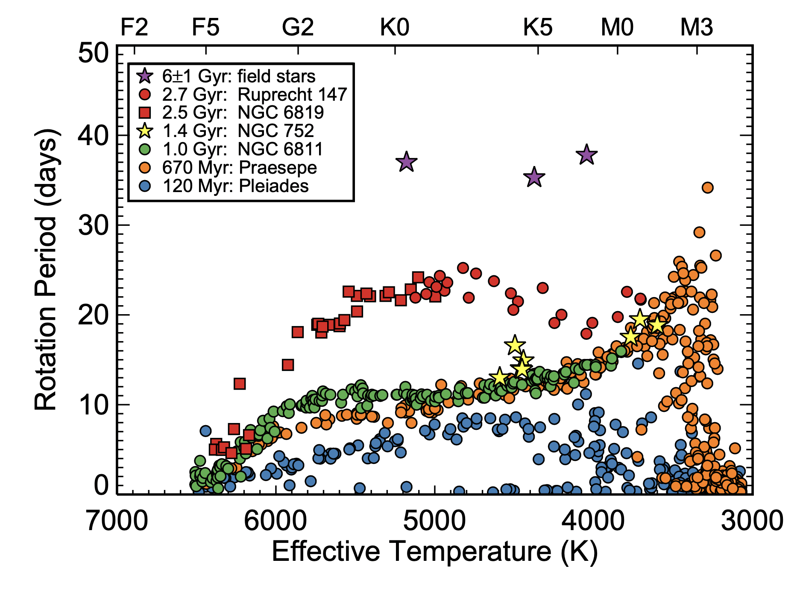

+++
date = '2026-04-06T13:38:04+02:00'
draft = false
title = 'Monday Lab 1: Gyrochronology'
+++


*Author: Joey Mombarg (lead TA), Niall Miller, Eliza Frankel - Lecturer: Yaguang Li — MESA Summer School 2026, Tetons, Wyoming*

*Special thanks to the Monday Lab of the MESA Summer School 2025 at KU Leuven for the template, and Nick Saunders for sharing his MESA setup used in [Saunders et al. (2024)](https://ui.adsabs.harvard.edu/abs/2024ApJ...962..138S/abstract).*

In this lab, you will learn how to set up a MESA model from scratch,
monitor the run, and customize its output.

### **Introduction**

Stars with a (significant) convective envelope experience a braking of their rotation velocity at the surface by magnetically-driven stellar winds. The wind carries away angular momentum from the surface of the star,
thereby applying a torque on the convective envelope. The effect of magnetic braking is clear in the observed distributions of surface rotation velocities, where there is a clear decrease seen in the surface rotation velocity below the so-called Kraft break, around 6500K. The decrease in the surface rotation velocity of stars below the Kraft break happens in a quite predictible way over time such that we can estimate the age of a cluster. In this Lab, we will run a model of a star that is undergoing magnetic braking and measure the age of a stellar cluster from gyrochronology.

In the figure below from [Curtis et al. (2020)](https://ui.adsabs.harvard.edu/abs/2020ApJ...904..140C/abstract) (their Fig. 7), you can see observed distributions of rotation periods as a function of effective temperature (from Gaia DR2 colors) of stars in clusters and field stars of different ages. In this lab, we will make such a $T_{\rm eff}-P_{\rm rot}$ figure with MESA, using crowd sourcing.


---

### **Outline**

**A. Setting up your MESA work directory**
- *\~10 minutes*
- Learn how to initialize a new MESA run directory from the default templates and understand the directory structure.

**B. Setting up your MESA project inlist**
- *\~20 minutes*
- Adjust the inlist files to define key input physics.

**C. Setup pgplot and run the model**
- *\~25 minutes*
- Use `pgstar` and log file outputs to live plot the evolution.


---

### A:  Setting up your MESA work directory

1. We will start from the default MESA work directory and
build up our inlist. Start by copying over the default MESA work directory to some folder outside of MESA:

```bash
    cp -r $MESA_DIR/star/work work_lab1
```

Try to compile with ``./mk``.
If everything compiled correctly, you should see a number of executables, namely `clean`, `mk`, `re` and
`rn` when you type ``ls``.
The subdirectory _src_ contains the ``run_star_extras.f90`` file, which allows you to add additional physics and generate custom output. We will use this to add our own custom routine to apply magnetic braking via the option
in the ``run_star_extras.f90`` to provide an additional torque. For now, just simply replace the default ``run_star_extras.f90`` file with the one of Lab 1 found [here](https://drive.google.com/drive/folders/1Mpy0fKF4LbWB4q5UqUrYw_0PBFqZ-DY1). You will learn about ``run_star_extras.f90`` in the labs later in the week.


Everytime you change something to the ``run_star_extras.f90``, you have to recompile to apply the changes. Go back up one level to the work directory and type ``./clean; ./mk`` to check if it compiles correctly.

The inlists contain all the input parameters for the MESA run. You will see *inlist*,
*inlist_pgstar* and *inlist_project*.

The file *inlist* redirects MESA to the other two
inlist files for all the real content, with *inlist_project* containing
the input parameters and *inlist_pgstar* containing the parameters for the visuals MESA should produce during the run. Note that if you do not specifically set a parameter/control in the inlist,
MESA assumes some default value that might not be optimal for your specific science case.

### B:  Setting up your MESA project inlist

2. We will now set the parameters/controls in the *inlist_project*. **Open *inlist_project* with a text editor and replace the content with the inlist skeleton below.** (There is a buttom to copy the entire block in the top right corner.)



```fortran
&star_job

      pause_before_terminate = .true.
      show_log_description_at_start = .true.

      ! pgstar

      ! pre main sequence

      ! initial rotation

      ! initial metal fractions


/ ! end of star_job namelist

&eos

/ ! end of eos namelist

&kap


/ ! end of kap namelist

&controls

      ! ZAMS limit

      ! uniform viscosity

      ! initial mass

      ! initial He and Z

      ! stopping criterion

      ! output

      ! atmosphere options

      ! Enable magnetic braking.
      use_other_torque    = .false.

/ ! end of controls namelist


&pgstar

! We set the pgstar controls in a seperate inlist instead.

/ ! end of pgstar namelist

&colors

/ ! end of colors namelist
```


   You will see different sections, indicated by for example

   ```bash
   &star_job
   / ! end of star_job namelist
   ```

Let's start with ``&controls``. Pick a mass from the [spreadsheet](https://docs.google.com/spreadsheets/d/1C88C5V2siCAaK8-3qgAZoNc9-9IH-RTIqFVetXQc3EM/edit?gid=0#gid=0) and set the initial mass equal to that value.
If you have a less powerful machine, consider picking a higher mass.


```fortran
initial_mass = 1d0
```


We want to run a model starting from the pre-main sequence up to the point when the hydrogen-mass fraction in the core ($X_{\rm c}$) is less than 0.01.
First, in ``&star_job`` set

```fortran
create_pre_main_sequence_model = .true.
pre_ms_T_c = 9.9d5 ! Initial central temperature.
```

and in ``&controls`` set

```fortran
xa_central_lower_limit_species(1) = 'h1'
xa_central_lower_limit(1) = 0.01
```



In principle, you can specify multiple lower limits, for example ``xa_central_lower_limit_species(2) = 'c12'``, and so on.
MESA will stop the run based on whichever criterion is met first.




The initial composition of the star can be set by adding the following in ``&controls``

```fortran
initial_z = 0.0134
initial_y = 0.2485
```

The initial mixture (relative mass fractions of the metals) of the star can be set by adding the following in ``&star_job``
```fortran
   initial_zfracs = 6 ! AGSS09_zfracs
```
These three controls gives us a star with a solar metallicity and metal fractions according to those measured for the Sun by [Asplund et al. (2009)](https://ui.adsabs.harvard.edu/abs/2009ARA%26A..47..481A/abstract).


You can find the metal fractions in
```bash
$MESA_DIR/chem/public/chem_def.f90
```




Next, we will enable rotation. One option to do this, is by relaxing a non-rotating model to a specific uniform rotation frequency at the zero-age main sequence (ZAMS). We relax the ZAMS model
in 15 steps to reach a velocity of $3.1416\cdot 10^{-5}$ rad/s, roughly 10 times the current surface rotation frequency of the Sun. Add in ``&star_job``:

```fortran
  new_omega =  3.1416d-5 ! 5000nHz
  set_near_zams_omega_steps = 15

```



Similarly, you can also define the initial rotation as a fraction of the Keplerian critical break-up frequency or as a surface velocity at the equator in km/s, but we will not
use these options for this lab.



We have to provide MESA with a working definition of the ZAMS, which we define here as the point where 95% of the total luminosity comes from nuclear reactions.
In ``&controls``, set

```fortran
Lnuc_div_L_zams_limit = 0.95
```

We will enforce uniform rotation throughout the evolution. In MESA, the transport of angular momentum is done in a fully diffusive framework, where the efficiency is set by an effective viscosity.
Diffusive transport want to erase any gradient in the local rotation frequency.
To enfore uniform rotation, we set the viscosity to a very high value, making the transport of angular momentum almost instantaneous.  As mentioned before, if you do not set
an inlist control yourself, MESA will assume a default value. First, have a look at [the documentation](https://docs.mesastar.org/en/25.12.1/reference/controls.html) to see what MESA does by default for the effective viscosity.
The control that we need is called ``uniform_am_nu_non_rot``.

**Question**: What is the default for the effective viscosity for angular momentum transport? Make sure it is enabled.



By default, MESA does not set a uniform effective viscosity, because ``set_uniform_am_nu_non_rot = .false.``. The default value of ``uniform_am_nu_non_rot`` MESA will use when this flag is set to true is so large that
we will enfore uniform rotation.

Thus, in ``&controls``, set

```fortran
set_uniform_am_nu_non_rot = .true.
uniform_am_nu_non_rot = 1d20 ! in cm^2/s
```



In MESA, we have to make a choice which opacity tables to use. MESA comes with several precomputed opacity tables for different sets of (X,Z), which are computed from monochromatic opacities, assuming a specific mixture.
Since we want to be consistent with the Asplund et al. (2009) Solar mixture that we took, we use the appropriate opacity tables. Set the following controls in the ``&kap`` section.

```fortran
!opacities with AGSS09 abundances
kap_file_prefix = 'OP_a09_nans_removed_by_hand'
kap_lowT_prefix = 'lowT_fa05_a09p'
kap_CO_prefix   = 'a09_co'

use_Type2_opacities = .false.
```
Type 2 opacities account for carbon and oxygen enhancement during and after He burning. We are not using those in this lab.

We also need to set the atmospheric boundary conditions. We are using a simple $T(\tau)$ relation for an Eddington grey atmosphere with a varying opacity in the atmosphere that is consistent with the local temperature
and pressure. Add the following controls to ``&controls``.

```fortran
atm_option = 'T_tau'
atm_T_tau_relation = 'Eddington'
atm_T_tau_opacity = 'varying'
```

Pick a sensible name for the directory where all the output will be stored (in ``&controls``), for example

```fortran
log_directory = '1Msun_Z0p0134_Omega5000nHz_no_magnetic_braking'
```

To have MESA write out a row in the history file every time step, add the following in the same section.

```fortran
history_interval = 1
```

Lastly, we want MESA to do live plotting of the evolution with ``pg_star``. Set the following flag to true in ``&star_job``:

```fortran
   pgstar_flag = .true.
```

Note that if you only change your inlists between runs, you do not need to recompile. Save the file and return to your work directory.


### C: Running the models

3. Next, we will generate some custom plots during the run. We want to check that if there is no magnetic braking (no external torque), the total angular momemtum of the star should be conserved.
**Replace *inlist_pgstar* with the one found [here](https://drive.google.com/drive/folders/1Mpy0fKF4LbWB4q5UqUrYw_0PBFqZ-DY1). Open *inlist_pgstar* with a text editor and add the following at the indicated place.**

```fortran
Grid1_plot_name(7) = 'History_Track2'

History_Track2_title = 'total AM'
History_Track2_xname = 'log_star_age'
History_Track2_yname = 'log_total_angular_momentum'
History_Track2_xaxis_label = 'log_star_age'
History_Track2_yaxis_label = 'log_total_angular_momentum'

History_Track2_ymin = 47
History_Track2_ymax = 50
```
Save and return to your work directory.

> [!TIP]
> You can change controls in the pgstar inlist during a run and the windows will be changed on the fly.


4. We will now run our model (first without magnetic braking). In the work directory, run ``./rn``.
    You will see that after the relaxation phase MESA complains about about the quantities that we want to plot in our custom window (`ERROR: failed to find * in history data`). This is because these quantities are not saved in the history file by default.
    You can stop the run prematurely with ctrl+C.
    The files that dictate what output should be saved can be found in

    ```bash
    $MESA_DIR/star/defaults/history_columns.list
    $MESA_DIR/star/defaults/profile_columns.list
    ```

    Copy the ``history_columns.list`` to your work directory and open it. Look for the quantities in the error messages and make sure they are uncommented (no ! in front).
    Also uncommented ``log_star_age`` and ``log_total_angular_momentum``. Save and close the file, no need to recompile.
    If you rename your custom ``history_columns.list`` and ``profile_columns.list``, you need to specify the names in ``&star_job``.

    ```fortran
    history_columns_file = 'custom_history_columns.list'
    profile_columns_file = 'custom_profile_columns.list'
    ```

    Let's run the model again, ``./rn``. At some point, a window will show up.

    At the top left panel, you see the local angular rotation frequency as a function of the radial coordinate (in $R_\odot$). Since we enfore uniform rotation, you should see a flat line. Next to this panel, you see the local chemical diffusion coefficient as a function of the mass coordinate. The blue regions are convective regions and have such high diffusion coefficients that the material is instantaneously mixed within the convective zones. The orange line is the radiative envelope mixing that is set in the inlist. Since we do not include any rotational mixing, the other colors in the legend should not show up.

    If the pgplot window does not fit your screen properly, you can change the following controls in ``inlist_pgstar``.

    ```fortran
    Grid1_win_width = <value>
    Grid1_win_aspect_ratio = <value>
    ```


**Question**: Have a look at our custom window showing the total angular momentum over time. Is it indeed conserved (after relaxation)? (You may stop the run if you are convinced.)


5. Now we will turn on magnetic braking. The quantity that we need for this is the change of the total angular momemtum $J$ over time. We make a distinction between the regime where the magnetic field strength is saturated and when it is growing. The regime that we are in is defined by the convective Rossy number, the ratio of the (surface) rotation period over the convective turnover time, ${\rm Ro} = P_{\rm rot}/\tau_{\rm conv}$. The Rossby number is a dimensionless parameter in fluid dynamics representing the ratio of inertial forces to Coriolis forces in a rotating fluid. It has been shown to correlate strongly with stellar magnetic activity ([Noyes et al. 1984](https://ui.adsabs.harvard.edu/abs/1984ApJ...279..763N/abstract)).

We adopt a ${\rm d}J/{\rm d}t$ prescription that appears to reproduce many observed cluster properties (see Fig. 2 of [Chiti et al. 2024](https://ui.adsabs.harvard.edu/abs/2024ApJ...977...15C/abstract)), following the work of [Kawaler (1988)](https://ui.adsabs.harvard.edu/abs/1988ApJ...333..236K/abstract) and [van Saders & Pinsonneault (2013)](https://ui.adsabs.harvard.edu/abs/2013ApJ...776...67V/abstract). 
If ${\rm Ro} < {\rm Ro_{\rm sat}}$ (saturated),
$$
\frac{{\rm d}J}{{\rm d}t} = T_0 \Omega_{\rm surf}  \left(\frac{\Omega_{\rm sat}}{\Omega_\odot}\right)^2,
$$


If ${\rm Ro} > {\rm Ro_{\rm sat}}$ (unsaturated),
$$
\frac{{\rm d}J}{{\rm d}t} = T_0 \Omega_{\rm surf}  \left(\frac{\Omega_{\rm surf} \tau_{\rm conv}}{\Omega_\odot \tau_{{\rm conv},\odot}}\right)^2,
$$

where

$$
T_0 =  K \left( \frac{R}{R_\odot} \right)^{3.1} \left( \frac{M}{M_\odot} \right)^{-0.22} \left( \frac{L}{L_\odot} \right)^{0.56} \left( \frac{P_{\rm surf}}{P_{{\rm surf},\odot}} \right)^{0.44}.
$$
Furthermore, $K$, ${\tau_{\rm conv, \odot}}$ and ${\rm \Omega_{\rm sat}}$ are constants that need to be calibrated.



As a reference, we use the following set of calibrated values.
$$
K = 5.655 \cdot 4.9715223932 \cdot 10^{35}
$$
$$
P_{\rm phot, \odot} = 100179.864~{\rm dyn}
$$
$$
\Omega_{\rm sat} = 3.863\cdot 10^{-5}{\rm rad/s}
$$
$$
\Omega_{\odot} = 2.863\cdot 10^{-6}{\rm rad/s}
$$




We do not expect significant magnetic braking when the Rossby number exceeds a critical value ([Saunders et al. 2024](https://ui.adsabs.harvard.edu/abs/2024ApJ...962..138S/abstract)), which we take as,

$$
{\rm Ro_{\rm crit}} = 0.91 {\rm Ro_{\odot}}.
$$

 To enable the magnetic braking ``run_star_extras`` routine, we set the following flag in ``&controls`` equal to True.


```fortran
! Enable magnetic braking.
use_other_torque    = .true.
```

This enables the custom magnetic braking routine in the ``run_star_extras.f90``. Change the name for the output log directory to save this run in a new folder. Check the evolution of the total angular momentum again. Do you now observe any angular momentum loss?
Hit Enter once you have finished inspecting the plots.

**Task**: Note down the effective temperature and rotation period at the 5 different points in age in the [spreadsheet](https://docs.google.com/spreadsheets/d/1C88C5V2siCAaK8-3qgAZoNc9-9IH-RTIqFVetXQc3EM/edit?gid=0#gid=0). If you star does not reach the older ages, leave those blanc.


**Bonus question**: How is the rotational evolution affected by the initial rotation velocity (``new_omega``)?

> [!TIP]
> You can find the complete inlist of this lab in the box below.




```fortran
&star_job

      pause_before_terminate = .true.
      show_log_description_at_start = .true.

      ! pgstar

      pgstar_flag = .true.

      ! pre main sequence

      create_pre_main_sequence_model = .true.
      pre_ms_T_c = 9.9d5 ! Initial central temperature.

      ! initial rotation

      new_omega =  3.1416d-5 ! 5000nHz
      set_near_zams_omega_steps = 15

      ! initial metal fractions

      initial_zfracs = 6 ! AGSS09_zfracs

/ ! end of star_job namelist

&eos

/ ! end of eos namelist

&kap

      ! opacities with AGSS09 abundances
      kap_file_prefix = 'OP_a09_nans_removed_by_hand'
      kap_lowT_prefix = 'lowT_fa05_a09p'
      kap_CO_prefix   = 'a09_co'

      use_Type2_opacities = .false.

/ ! end of kap namelist

&controls

      ! ZAMS limit
      Lnuc_div_L_zams_limit = 0.95

      ! uniform viscosity
      set_uniform_am_nu_non_rot = .true.
      uniform_am_nu_non_rot = 1d20 ! in cm^2/s

      ! initial mass
      initial_mass = 1.2d0

      ! initial He and Z
      initial_z = 0.0134
      initial_y = 0.2485

      ! stopping criterion
      xa_central_lower_limit_species(1) = 'h1'
      xa_central_lower_limit(1) = 0.01

      ! output
      log_directory = '1p2Msun_Z0p0134_Omega5000nHz_magnetic_braking_test'
      history_interval = 1

      ! atmosphere options
      atm_option = 'T_tau'
      atm_T_tau_relation = 'Eddington'
      atm_T_tau_opacity = 'varying'

      ! Enable magnetic braking.
      use_other_torque    = .true.

/ ! end of controls namelist

&pgstar

! We set the pgstar controls in a seperate inlist instead.

/ ! end of pgstar namelist

&colors

/ ! end of colors namelist
```



